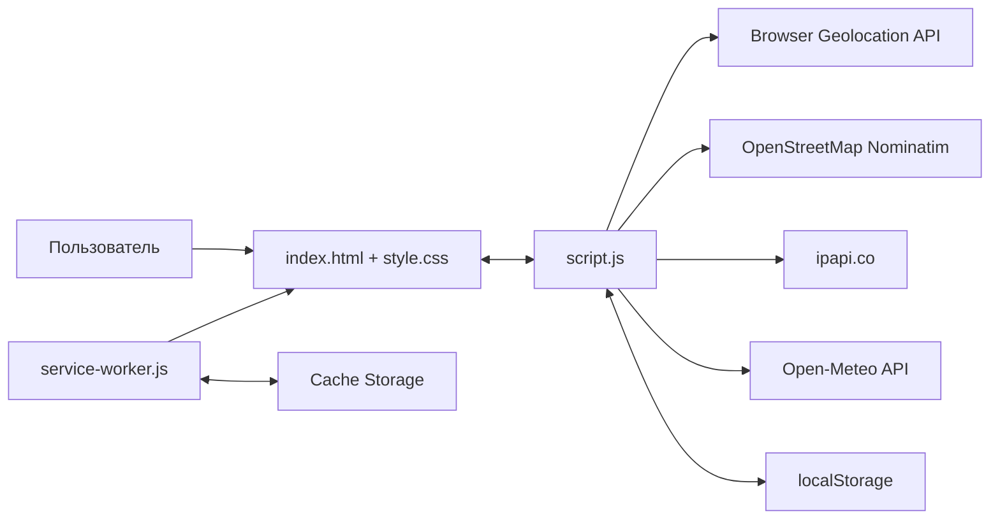

# Архитектура Weather Companion

## Обзор

Weather Companion — одностраничное погодное PWA-приложение на HTML, CSS и JavaScript. Оно работает полностью в браузере, не использует серверную часть, сборщик или внешние JavaScript-зависимости. Данные о погоде и местоположении поступают из публичных HTTP API, а пользовательские настройки и последний успешный прогноз сохраняются локально.

## Компоненты

| Файл | Ответственность |
| --- | --- |
| `index.html` | Семантическая структура интерфейса: поиск, настройки, текущая погода, почасовой и недельный прогноз. Подключает стили, манифест и основной скрипт. |
| `style.css` | Адаптивная компоновка, светлая и тёмная темы, погодные цветовые схемы, состояния загрузки и ошибок, анимации. |
| `script.js` | Вся прикладная логика: состояние, события UI, геолокация, запросы к API, нормализация и отображение данных, рекомендации по одежде, локальное хранение. |
| `service-worker.js` | Кэширует оболочку приложения и позволяет открыть интерфейс без сети. Для ресурсов того же origin используется стратегия cache-first с фоновым сетевым запросом. |
| `manifest.webmanifest` | Метаданные устанавливаемого PWA: имя, цвета, режим `standalone`, стартовая страница и иконка. |
| `icon.svg` | Иконка приложения. |

## Слои приложения

### Представление

DOM-каркас задаётся в `index.html`, а `script.js` обновляет заранее определённые элементы по `id`. Прогнозы и метрики создаются динамически через HTML-шаблоны. Иллюстрация одежды строится программно как SVG и зависит от температуры и типа осадков.

CSS-переменные образуют систему темизации. На `body` одновременно назначаются:

- класс темы: `theme-light` или `theme-dark`;
- класс текущей погоды: `body-weather-clear`, `cloudy`, `rainy`, `snowy` или `stormy`.

### Прикладная логика

Код выполняется внутри обработчика `DOMContentLoaded` и не экспортирует глобальный API. Основные группы функций:

- получение и сохранение состояния — `getStored`, `setStored`;
- загрузка данных — `fetchWeather`, `searchByCity`, `reverseGeocode`, `getLocationByIP`;
- преобразование данных — `normalizeForecast`, `convertTemp`, форматирование даты и времени;
- отображение — `renderWeather`, `renderMetrics`, `renderHourlyForecast`, `renderWeeklyForecast`, `updatePerson`;
- пользовательские настройки — тема, единицы температуры, избранное и история;
- обработка состояний загрузки, ошибок и offline-режима.

Состояние хранится в замыканиях `script.js`: текущая локация и снимок прогноза, единицы измерения, тема, история, избранное и последний погодный код.

### Интеграции

| Сервис | Назначение | Основной сценарий |
| --- | --- | --- |
| Open-Meteo | Текущая погода, почасовой и семидневный прогноз | Координаты → нормализованный снимок прогноза |
| Nominatim / OpenStreetMap | Прямое и обратное геокодирование | Название города ↔ координаты |
| Browser Geolocation API | Точные координаты устройства с разрешения пользователя | Предпочтительный способ определения локации |
| ipapi.co | Приблизительная локация по IP | Резерв при отказе или недоступности геолокации |

API вызываются напрямую из браузера через `fetch`; секреты и API-ключи в проекте отсутствуют.

## Потоки данных

### Первоначальная загрузка

1. Приложение читает настройки и пользовательские данные из `localStorage`.
2. Если сохранён прошлый прогноз, он сразу показывается как offline-снимок.
3. Если сохранена последняя локация, приложение обновляет её прогноз.
4. Иначе запрашивается геолокация устройства.
5. При ошибке геолокации используется IP-локация, а при ошибке IP-сервиса — Москва как резервная точка.
6. После успешного ответа Open-Meteo данные нормализуются, отображаются и сохраняются.

### Поиск города

1. Пользователь вводит город.
2. Nominatim возвращает название и координаты первого совпадения.
3. Локация добавляется в историю, ограниченную восемью уникальными координатами.
4. По координатам запрашивается прогноз Open-Meteo.

### Ошибка сети

Если запрос прогноза завершается ошибкой, приложение показывает последний `weatherApp.lastSnapshot`. При отсутствии снимка выводятся ошибки текущей погоды и прогноза. Service Worker независимо кэширует только локальную оболочку; ответы сторонних API в Cache Storage не сохраняются.

## Локальные данные

Все значения сериализуются в JSON в `localStorage`.

| Ключ | Содержимое |
| --- | --- |
| `weatherApp.unit` | `c` или `f` |
| `weatherApp.theme` | `auto`, `light` или `dark` |
| `weatherApp.lastLocation` | Последняя локация: имя, широта и долгота |
| `weatherApp.lastSnapshot` | Последний нормализованный прогноз и время сохранения |
| `weatherApp.favorites` | До восьми избранных локаций |
| `weatherApp.history` | До восьми последних уникальных локаций |

## PWA и кэширование

При запуске регистрируется `service-worker.js`. Во время установки он помещает локальные файлы приложения в кэш `weather-app-v1`. При активации удаляются кэши с другими именами.

Для GET-запросов того же origin Service Worker сначала отдаёт найденный кэшированный ответ, параллельно запрашивает ресурс из сети и обновляет кэш. При полном сбое используется `index.html`. Внешние запросы к Open-Meteo, Nominatim и ipapi.co Service Worker не перехватывает.

## Ограничения и направления развития

- `script.js` объединяет интеграции, состояние и представление в одном модуле; при росте проекта их стоит разделить.
- Автотема определяется по локальному времени только при вызове `setTheme` и не переключается сама на границе дня и ночи.
- Offline-прогноз представлен одним последним снимком, а не отдельным кэшем по городам.
- Поиск выбирает только первое совпадение Nominatim и не предлагает уточнить неоднозначный город.
- Автоматические тесты и инфраструктура сборки отсутствуют; файл `test` пуст.
- Для публикации необходим HTTPS: без него геолокация и Service Worker обычно недоступны вне `localhost`.
- Прямые браузерные интеграции зависят от доступности, CORS и ограничений публичных API; при промышленной нагрузке может потребоваться собственный backend/proxy.

## Запуск и развёртывание

Проект следует обслуживать любым статическим HTTP-сервером из корня репозитория. Точка входа — `index.html`; компиляция и установка зависимостей не нужны. Для production-развёртывания сервер должен поддерживать HTTPS и отдавать файлы с корректными MIME-типами, включая `manifest.webmanifest`, JavaScript, CSS и SVG.
